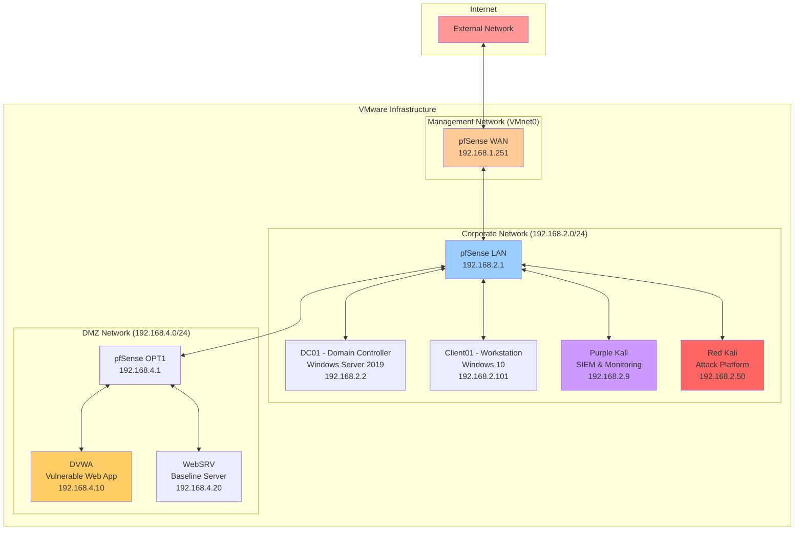
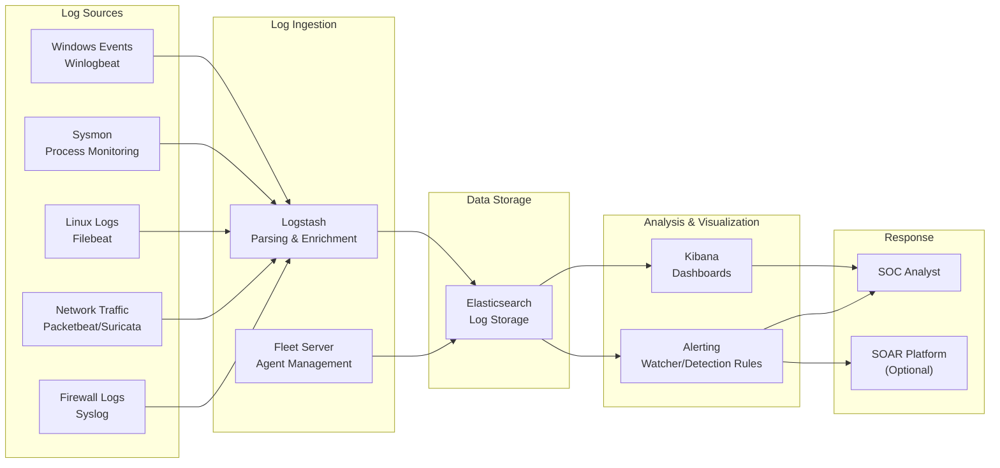
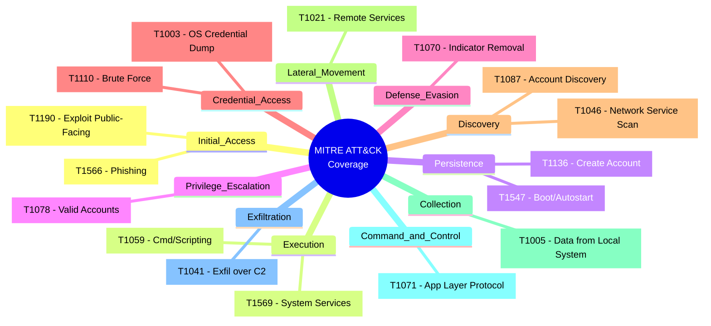
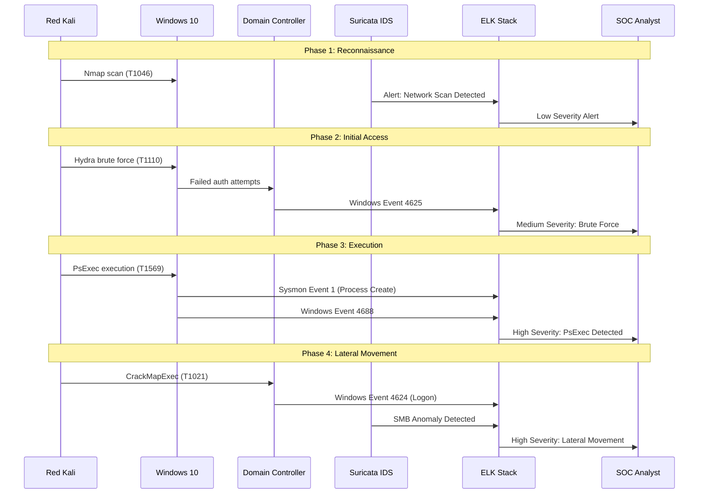

# Architecture Overview

## Table of Contents

1. [Design Principles](#design-principles)
2. [High-Level Architecture](#high-level-architecture)
3. [Network Architecture](#network-architecture)
4. [Security Zones](#security-zones)
5. [Component Interactions](#component-interactions)
6. [Data Flow Patterns](#data-flow-patterns)
7. [Mermaid Diagrams](#mermaid-diagrams)

---

## Design Principles

The Enterprise SOC Lab follows enterprise-grade design principles:

### Defense in Depth
Multiple security layers provide overlapping protection:
- Network segmentation with VLAN isolation
- Host-based monitoring (Sysmon, Elastic Agent)
- Network-based detection (Suricata IDS/IPS)
- Centralized log aggregation and analysis

### Zero Trust Architecture
- No implicit trust based on network location
- Continuous verification of all access attempts
- Micro-segmentation between network zones
- Comprehensive logging for all traffic flows

### Visibility-First Approach
- Full packet capture capability (Suricata, Packetbeat)
- Process execution monitoring (Sysmon)
- Authentication event logging (Windows Event Log)
- Network flow analysis (NetFlow)

### Purple Team Integration
- Attack and defense capabilities in single environment
- Real-time detection validation
- MITRE ATT&CK framework alignment
- Continuous detection engineering

---

## High-Level Architecture

### ASCII Architecture Diagram

```
┌─────────────────────────────────────────────────────────────────────────────┐
│                           INTERNET / EXTERNAL                                │
└─────────────────────────────────────────────────────────────────────────────┘
                                       │
                                       ▼
┌─────────────────────────────────────────────────────────────────────────────┐
│                         PFSENSE FIREWALL (NGFW)                              │
│                    Suricata IDS/IPS | NAT | VPN | Rules                      │
│                         WAN: 192.168.1.251                                   │
└─────────────────────────────────────────────────────────────────────────────┘
                                       │
           ┌───────────────────────────┼───────────────────────────┐
           │                           │                           │
           ▼                           ▼                           ▼
┌─────────────────────┐  ┌─────────────────────┐  ┌─────────────────────┐
│   CORPORATE ZONE    │  │   SOC/BLUE ZONE     │  │   DMZ/PUBLIC ZONE   │
│   192.168.2.0/24    │  │   192.168.2.0/24    │  │   192.168.4.0/24    │
│   (High Trust)      │  │   (Medium Trust)    │  │   (Low Trust)       │
│                     │  │                     │  │                     │
│  ┌───────────────┐  │  │  ┌───────────────┐  │  │  ┌───────────────┐  │
│  │  Domain Ctrl  │  │  │  │  Purple Kali  │  │  │  │     DVWA      │  │
│  │  192.168.2.2  │  │  │  │  192.168.2.9  │  │  │  │  192.168.4.10 │  │
│  │   (Win2019)   │  │  │  │               │  │  │  │               │  │
│  │  AD/DNS/DHCP  │  │  │  │ • ELK/Splunk  │  │  │  │  Vulnerable   │  │
│  └───────────────┘  │  │  │ • MISP TI     │  │  │  │  Web App      │  │
│                     │  │  │ • Fleet/DS    │  │  │  └───────────────┘  │
│  ┌───────────────┐  │  │  │ • Canary      │  │  │                     │
│  │   Client01    │  │  │  │ • Atomic Red  │  │  │  ┌───────────────┐  │
│  │ 192.168.2.101 │  │  │  │   Team        │  │  │  │    WebSRV     │  │
│  │   (Win10)     │  │  │  └───────────────┘  │  │  │  192.168.4.20 │  │
│  │  Sysmon + UF  │  │  │                     │  │  │               │  │
│  └───────────────┘  │  │  ┌───────────────┐  │  │  │   Baseline    │  │
│                     │  │  │   Red Kali    │  │  │  │   Server      │  │
│  ┌───────────────┐  │  │  │  192.168.2.50 │  │  │  └───────────────┘  │
│  │   Red Kali    │  │  │  │               │  │  │                     │
│  │  (Attacker)   │  │  │  │  Attack Sim   │  │  └─────────────────────┘
│  │ 192.168.2.50  │  │  │  │  Platform     │  │
│  └───────────────┘  │  │  └───────────────┘  │
└─────────────────────┘  └─────────────────────┘
```

---

## Network Architecture

### Physical/Virtual Topology

```
┌─────────────────────────────────────────────────────────────────────────────┐
│                           VMWARE INFRASTRUCTURE                              │
│                                                                              │
│  ┌─────────────────────────────────────────────────────────────────────┐   │
│  │                      VMNET0 - BRIDGED NETWORK                        │   │
│  │                         (192.168.1.0/24)                             │   │
│  │                                                                      │   │
│  │   ┌─────────────┐         ┌─────────────┐         ┌─────────────┐   │   │
│  │   │   pfSense   │◄───────►│   Host OS   │◄───────►│   Internet  │   │   │
│  │   │   WAN NIC   │         │             │         │             │   │   │
│  │   └──────┬──────┘         └─────────────┘         └─────────────┘   │   │
│  │          │                                                           │   │
│  │          │ LAN (192.168.2.1)                                         │   │
│  │          ▼                                                           │   │
│  │   ┌─────────────────────────────────────────────────────────────┐   │   │
│  │   │              VMNET2 - INTERNAL NETWORK                       │   │   │
│  │   │                   (192.168.2.0/24)                           │   │   │
│  │   │                                                              │   │   │
│  │   │   ┌─────────┐   ┌─────────┐   ┌─────────┐   ┌─────────┐     │   │   │
│  │   │   │  DC01   │   │Client01 │   │PurpleKali│   │RedKali  │     │   │   │
│  │   │   │.2.2     │   │.2.101   │   │.2.9     │   │.2.50    │     │   │   │
│  │   │   └─────────┘   └─────────┘   └─────────┘   └─────────┘     │   │   │
│  │   └─────────────────────────────────────────────────────────────┘   │   │
│  │                              │                                       │   │
│  │                              │ OPT1 (192.168.4.1)                    │   │
│  │                              ▼                                       │   │
│  │   ┌─────────────────────────────────────────────────────────────┐   │   │
│  │   │              VMNET4 - DMZ NETWORK                            │   │   │
│  │   │                   (192.168.4.0/24)                           │   │   │
│  │   │                                                              │   │   │
│  │   │   ┌─────────┐   ┌─────────┐                                 │   │   │
│  │   │   │  DVWA   │   │ WebSRV  │                                 │   │   │
│  │   │   │.4.10    │   │.4.20    │                                 │   │   │
│  │   │   └─────────┘   └─────────┘                                 │   │   │
│  │   └─────────────────────────────────────────────────────────────┘   │   │
│  └─────────────────────────────────────────────────────────────────────┘   │
└─────────────────────────────────────────────────────────────────────────────┘
```

### Network Interface Configuration

| VM Name | Interface | Network | IP Address | Gateway | Purpose |
|---------|-----------|---------|------------|---------|---------|
| pfSense | WAN | VMnet0 (Bridged) | DHCP / 192.168.1.251 | 192.168.1.1 | External connectivity |
| pfSense | LAN | VMnet2 (Internal) | 192.168.2.1 | - | Corporate network gateway |
| pfSense | OPT1 | VMnet4 (Internal) | 192.168.4.1 | - | DMZ network gateway |
| DC01 | eth0 | VMnet2 (Internal) | 192.168.2.2 | 192.168.2.1 | Domain controller |
| Client01 | eth0 | VMnet2 (Internal) | 192.168.2.101 | 192.168.2.1 | Domain workstation |
| PurpleKali | eth0 | VMnet2 (Internal) | 192.168.2.9 | 192.168.2.1 | SOC/SIEM server |
| RedKali | eth0 | VMnet2 (Internal) | 192.168.2.50 | 192.168.2.1 | Attack platform |
| DVWA | eth0 | VMnet4 (Internal) | 192.168.4.10 | 192.168.4.1 | Vulnerable web app |
| WebSRV | eth0 | VMnet4 (Internal) | 192.168.4.20 | 192.168.4.1 | Baseline web server |

---

## Security Zones

### Trust Boundary Model

```
┌─────────────────────────────────────────────────────────────────────────────┐
│                           TRUST BOUNDARY MODEL                               │
└─────────────────────────────────────────────────────────────────────────────┘

    HIGH TRUST                          MEDIUM TRUST                        LOW TRUST
    ┌─────────┐                        ┌─────────┐                        ┌─────────┐
    │  CORP   │◄────── Firewall ─────►│   SOC   │◄────── Firewall ─────►│   DMZ   │
    │  ZONE   │      (Stateful)        │  ZONE   │      (Restricted)      │  ZONE   │
    └────┬────┘                        └────┬────┘                        └────┬────┘
         │                                    │                                    │
         │  • Domain Controllers              │  • SIEM Servers                    │  • Web Servers
         │  • Workstations                    │  • Threat Intel                    │  • Public Services
         │  • Internal Apps                   │  • Log Aggregators                 │  • Guest Access
         │                                    │                                    │
    ┌────┴────┐                          ┌────┴────┐                          ┌────┴────┐
    │ Access  │                          │ Monitor │                          │ Expose  │
    │ Control │                          │  Only   │                          │ Minimal │
    └─────────┘                          └─────────┘                          └─────────┘
```

### Zone Characteristics

#### Corporate Zone (192.168.2.0/24) - High Trust
- **Purpose**: Internal user workstations and domain services
- **Access**: Authenticated domain users only
- **Monitoring**: Full endpoint monitoring, all logs forwarded
- **Outbound**: Restricted internet access via proxy
- **Inbound**: Blocked from DMZ, limited from SOC

#### SOC Zone (192.168.2.0/24) - Medium Trust
- **Purpose**: Security operations and monitoring infrastructure
- **Access**: SOC analysts, security tools service accounts
- **Monitoring**: Self-monitoring, audit logging
- **Outbound**: Limited to update servers, threat feeds
- **Inbound**: Log ingestion from all zones, admin access only

#### DMZ Zone (192.168.4.0/24) - Low Trust
- **Purpose**: Public-facing services and vulnerable applications
- **Access**: Unauthenticated internet access allowed
- **Monitoring**: Network monitoring, limited endpoint logs
- **Outbound**: Blocked to Corporate, limited to SOC for logs
- **Inbound**: HTTP/HTTPS from internet, blocked to internal

---

## Component Interactions

### Authentication Flow

```
┌─────────┐     ┌─────────┐     ┌─────────┐     ┌─────────┐
│ Client  │────►│   DC    │────►│   AD    │────►│  SYSVOL │
│   01    │     │  (DNS)  │     │   DS    │     │  (GPO)  │
└─────────┘     └─────────┘     └─────────┘     └─────────┘
     │               │               │               │
     │  1. DNS Query │               │               │
     │──────────────►│               │               │
     │               │               │               │
     │  2. SRV Record│               │               │
     │◄──────────────│               │               │
     │               │               │               │
     │  3. Kerberos AS-REQ           │               │
     │──────────────────────────────►│               │
     │               │               │               │
     │  4. TGT (AS-REP)              │               │
     │◄──────────────────────────────│               │
     │               │               │               │
     │  5. TGS-REQ (Service Ticket)  │               │
     │──────────────────────────────►│               │
     │               │               │               │
     │  6. Service Ticket (TGS-REP)  │               │
     │◄──────────────────────────────│               │
```

### Log Ingestion Flow

```
┌─────────────┐     ┌─────────────┐     ┌─────────────┐     ┌─────────────┐
│   Windows   │     │   Sysmon    │     │  Winlogbeat │     │ Logstash/   │
│   Events    │────►│   (ETW)     │────►│  (Agent)    │────►│  Beats      │
└─────────────┘     └─────────────┘     └─────────────┘     └──────┬──────┘
                                                                    │
┌─────────────┐     ┌─────────────┐     ┌─────────────┐            │
│   Linux     │     │   Auditd    │     │  Filebeat   │────────────┤
│   Events    │────►│   (Audit)   │────►│  (Agent)    │            │
└─────────────┘     └─────────────┘     └─────────────┘            │
                                                                    │
┌─────────────┐     ┌─────────────┐     ┌─────────────┐            │
│   Network   │     │   Suricata  │     │  Evebox/    │────────────┤
│   Traffic   │────►│   (IDS)     │────►│  Filebeat   │            │
└─────────────┘     └─────────────┘     └─────────────┘            │
                                                                    ▼
                                                           ┌─────────────┐
                                                           │Elasticsearch│
                                                           │  (Storage)  │
                                                           └──────┬──────┘
                                                                  │
                                                                  ▼
                                                           ┌─────────────┐
                                                           │   Kibana    │
                                                           │(Dashboards) │
                                                           └─────────────┘
```

---

## Data Flow Patterns

### Normal Operations Flow

```
┌─────────────────────────────────────────────────────────────────────────────┐
│                         NORMAL OPERATIONS DATA FLOW                          │
└─────────────────────────────────────────────────────────────────────────────┘

  USER WORKFLOW                              MONITORING WORKFLOW
  ─────────────                              ─────────────────

┌─────────┐    ┌─────────┐    ┌─────────┐    ┌─────────┐    ┌─────────┐
│  User   │───►│  Login  │───►│  Access │    │  Event  │───►│  SIEM   │
│ Request │    │ (AD/Kerb)│   │ Resource│    │  Logged │    │ Ingested│
└─────────┘    └─────────┘    └─────────┘    └─────────┘    └─────────┘
                                                                  │
                                                                  ▼
┌─────────┐    ┌─────────┐    ┌─────────┐    ┌─────────┐    ┌─────────┐
│ Response│◄───│ Process │◄───│ Validate│◄───│  Alert  │◄───│  Check  │
│  Sent   │    │ Request │    │  Access │    │ Trigger │    │  Rules  │
└─────────┘    └─────────┘    └─────────┘    └─────────┘    └─────────┘
```

### Attack Detection Flow

```
┌─────────────────────────────────────────────────────────────────────────────┐
│                          ATTACK DETECTION FLOW                               │
└─────────────────────────────────────────────────────────────────────────────┘

  ATTACK CHAIN                               DETECTION CHAIN
  ────────────                               ──────────────

┌─────────┐    ┌─────────┐    ┌─────────┐    ┌─────────┐    ┌─────────┐
│ Recon   │───►│ Initial │───►│ Lateral │    │  IDS/   │───►│  SIEM   │
│ (Nmap)  │    │ Access  │    │ Movement│    │ Endpoint│    │ Correl. │
└─────────┘    └─────────┘    └─────────┘    └─────────┘    └─────────┘
     │               │               │                              │
     │               │               │                              ▼
     │               │               │                       ┌─────────┐
     │               │               │                       │  Alert  │
     │               │               │                       │ Created │
     │               │               │                       └────┬────┘
     │               │               │                            │
     ▼               ▼               ▼                            ▼
┌─────────┐    ┌─────────┐    ┌─────────┐                   ┌─────────┐
│ Suricata│    │ Windows │    │ Windows │                   │  SOC    │
│  Alert  │    │  Event  │    │  Event  │                   │ Analyst │
│ Generated│   │  4625   │    │  4648   │                   │ Notified│
└─────────┘    └─────────┘    └─────────┘                   └─────────┘
```

---

## Mermaid Diagrams

### Network Topology



### SIEM Data Flow



### MITRE ATT&CK Coverage



### Attack Lifecycle with Detections



---

## VMware Configuration

### Virtual Network Editor Settings

| VMnet | Type | Subnet | DHCP | Purpose |
|-------|------|--------|------|---------|
| VMnet0 | Bridged | N/A | No | WAN/Internet access |
| VMnet2 | Host-only | 192.168.2.0/24 | Yes | Corporate network |
| VMnet4 | Host-only | 192.168.4.0/24 | Yes | DMZ network |

### VM Resource Allocation

| VM | vCPU | RAM | Disk | Network |
|----|------|-----|------|---------|
| pfSense | 2 | 2GB | 20GB | VMnet0, VMnet2, VMnet4 |
| DC01 | 2 | 4GB | 60GB | VMnet2 |
| Client01 | 2 | 4GB | 40GB | VMnet2 |
| Purple Kali | 4 | 8GB | 100GB | VMnet2 |
| Red Kali | 2 | 4GB | 60GB | VMnet2 |
| DVWA | 1 | 2GB | 20GB | VMnet4 |
| WebSRV | 1 | 2GB | 20GB | VMnet4 |

---

## Security Controls Matrix

| Control Layer | Technology | Coverage | Detection Capability |
|---------------|------------|----------|---------------------|
| Network Perimeter | pfSense + Suricata | All traffic | Protocol anomalies, signatures |
| Endpoint (Windows) | Sysmon | Process/DNS/Network | Process injection, driver load |
| Endpoint (Linux) | Auditd + Auditbeat | System calls | Privilege escalation, file access |
| Identity | Windows Event Log | Authentication | Brute force, anomalous logons |
| Application | DVWA logs | Web attacks | SQLi, XSS, LFI attempts |
| Centralized | ELK/Splunk | All sources | Correlation, ML-based detection |

---

*Document Version: 2.0*  
*Last Updated: 2026-02-12*  
*Author:Engineer Maher Mansour*
